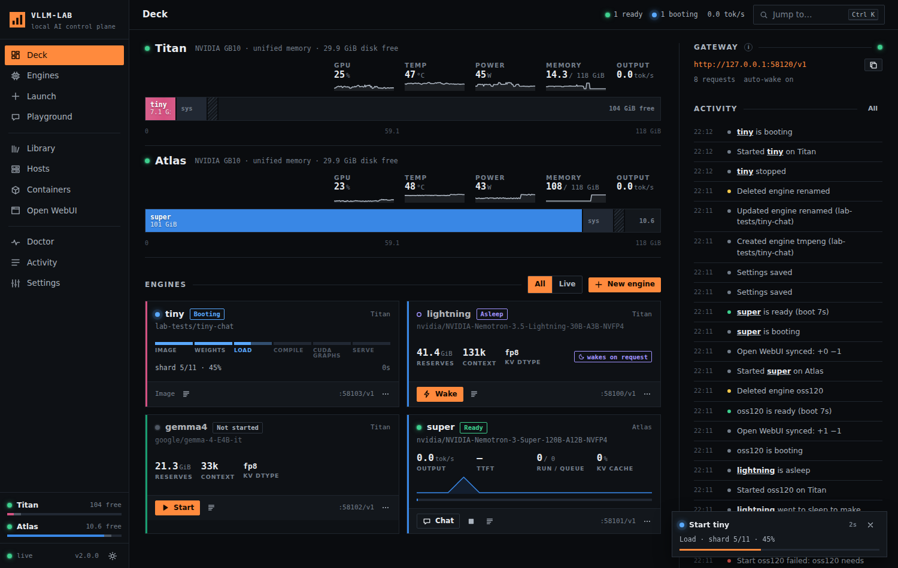
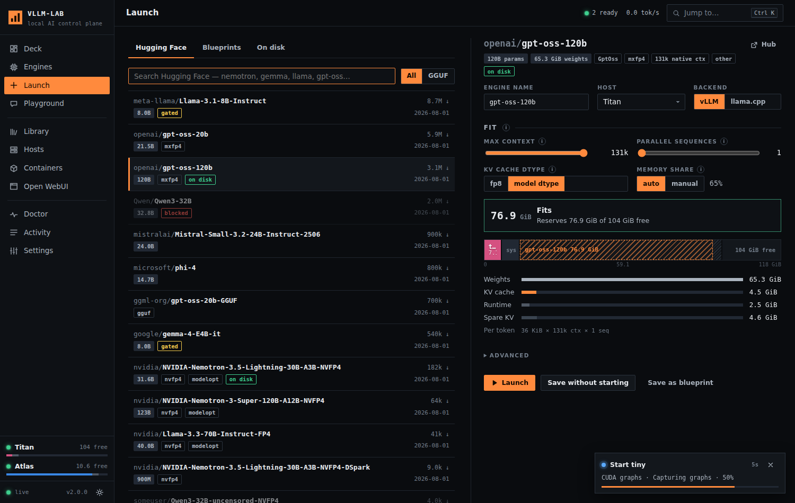
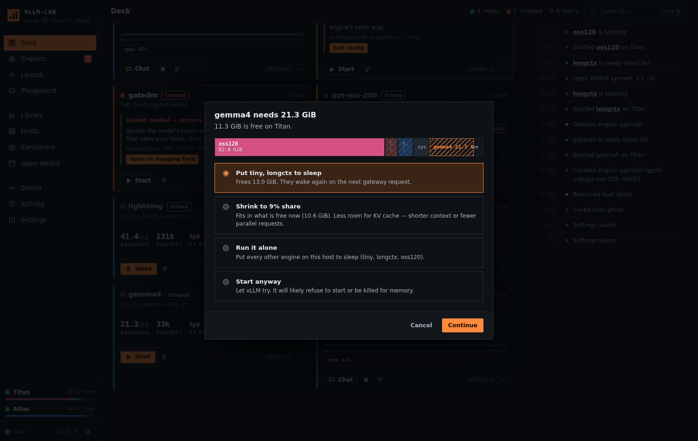
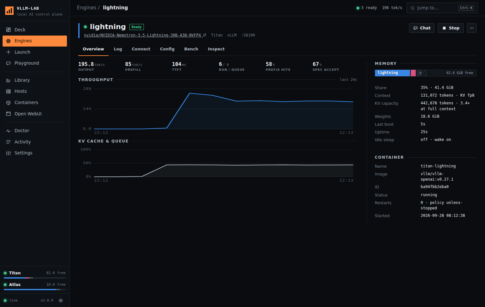

# vllm-lab 2

`vllm-lab` is a control plane for running local AI on NVIDIA DGX / GB10 boxes.

- Titan and Atlas today, and any other box you can SSH into later.
- Runs vLLM and llama.cpp engines, and finds Ollama wherever it is already installed.
- Ships as one Python file with no pip installs. It includes a CLI, a live web console, and an OpenAI-compatible gateway.



```
http://127.0.0.1:58120        console
http://127.0.0.1:58120/v1     gateway (one URL for every engine on every host)
```

---

## Upgrade from v1

The upgrade keeps your containers, ports and config. Your existing `titan-*` containers are adopted as they are.

```bash
sudo systemctl stop labui            # or whatever the unit is called
cp ~/bin/vllm_lab.py ~/bin/vllm_lab.v1.py
cp vllm_lab.py vllm-lab ~/bin/
sudo cp labui.service /etc/systemd/system/labui.service
sudo systemctl daemon-reload && sudo systemctl enable --now labui
vllm-lab doctor
```

What happens on the first start:

- **Config migration.** The old keys (`webui_url`, `webui_email`, `webui_password`, `hosts[].online`) are read and migrated automatically.
- **Engine migration.** `engines.json` is migrated to v2. The original is kept as `engines.v1.json`.
- **Recipes.** `lightning`, `gemma4` and `super` become regular engines you can edit. The recipe lock is gone.
- **Legacy containers.** Running containers show a `legacy` tag. They work as they are. Recreate each one once, when convenient, so config-drift tracking turns on.

---

## Core ideas

| Idea | What it means |
|---|---|
| **Engine** | One model served by one container: vLLM, or llama.cpp for GGUF. It has a name, a host, a port and a memory share. |
| **Memory share** | vLLM's `--gpu-memory-utilization`. On GB10 this is a slice of the 128 GB of *unified* memory. The console draws every share on a bar per host, called the tank. |
| **Fit** | Before a start, vllm-lab checks the share against free memory. If it will not fit, it offers choices instead of letting vLLM crash: put an idle engine to sleep, shrink the share, run it alone, or start anyway. |
| **Sleep / wake** | A sleeping engine is stopped: memory is freed and the weights stay cached. A gateway request for it wakes it. Idle sleep can put an engine to sleep automatically after N minutes. |
| **Blueprint** | A saved engine recipe. Built-ins cover Nemotron, Gemma, Llama, gpt-oss, Mistral and Phi. **Save as blueprint** stores your own. |

---

## Console tour

- **Deck**
  - A tank per host showing each engine's share, system memory, page cache and free memory.
  - Live GPU, temperature, power and throughput.
  - A card per engine, and the activity feed.
- **Engines**
  - A table of every engine.
  - Click one for its detail page, which has these tabs:

    | Tab | What it has |
    |---|---|
    | Overview | Live charts and boot facts: KV capacity and load time |
    | Log | Live, filterable |
    | Connect | Every URL, plus copy-ready snippets |
    | Config | Edit, then apply |
    | Bench | Load test with history |
    | Inspect | The exact `docker run` and `docker inspect` |
- **Launch**
  - Search Hugging Face, pick a blueprint, or reuse weights already on disk.
  - The fit planner reads the model's `config.json` and estimates weights plus KV cache for your context length and parallel sequences. It then sizes the share and shows the new engine as a ghost on the tank.
- **Playground**
  - Streaming chat with any engine, with an optional side-by-side compare of two engines.
  - Shows live tok/s and time to first token.
- **Library**
  - Cached weights per host: size, which engines use them, pre-download, delete.
  - Ollama models: pull, load, unload.
- **Hosts**
  - Add a box over SSH, test it, enable or disable it, and flush the page cache.
- **Containers**
  - A Portainer-style view of every container, image and network on a host.
- **Open WebUI**
  - Connection health as seen from inside the WebUI container.
  - Automatic sync: engines are added when ready and removed when stopped. Your own connections are never touched.
- **Doctor**
  - Checks every host, engine and integration, with one-click fixes.
- **Activity**
  - Everything that happened, and why.

| Launch fit planner | Make room |
|---|---|
|  |  |



Press **Ctrl K** anywhere for the command palette: start, stop, logs, chat, launch a blueprint, jump to a page.

---

## When something fails

The crash decoder turns the tail of a vLLM or llama.cpp log into a cause and a fix button:

| You see | Fix button |
|---|---|
| Not enough free memory at startup | Make room, Flush page cache, Fit to free memory |
| Context window does not fit in the KV cache | Use suggested context (the length vLLM itself reported) |
| Gated model, access not granted | Open on Hugging Face, Set HF token |
| This vLLM build is too old for Gemma 4 | Build patched runtime |
| Model needs remote code | Trust remote code |
| vLLM rejected an argument | Edit config |
| Image is not built for ARM64 | Edit config |
| Port already in use | Move to a free port |

An engine that crash-loops is stopped after 3 restarts (the crash guard), so it stops grabbing memory. The container is kept so you can read its log.

---

## CLI

```bash
vllm-lab                                # status of every host and engine
vllm-lab up lightning                   # start (live boot progress; Ctrl-C detaches)
vllm-lab up oss --blueprint gpt-oss-120b --host atlas
vllm-lab up trial --model google/gemma-4-E4B-it --util 0.2 --ctx 32768
vllm-lab solo super                     # start, putting the other engines on its host to sleep
vllm-lab stop gemma4 | sleep gemma4 | restart | recreate | rm NAME [--delete]
vllm-lab logs lightning -f
vllm-lab fix gemma4 set-context         # apply a suggested fix
vllm-lab plan nvidia/NVIDIA-Nemotron-3-Super-120B-A12B-NVFP4 --host atlas --ctx 65536
vllm-lab search nemotron                # restricted-origin results are flagged
vllm-lab pull openai/gpt-oss-120b --host atlas
vllm-lab probe lightning | bench lightning -c 8 -n 32
vllm-lab doctor
vllm-lab host atlas --ssh titan@10.20.0.12 --human-host 10.20.0.12 --enabled true
vllm-lab config --hf-token hf_… --webui-key sk-… --gateway-key …
vllm-lab export > lab.json   |   vllm-lab import lab.json
```

---

## Gateway

One OpenAI-compatible endpoint that routes by the `model` field. The field can be:

- an engine name, like `lightning`
- a served model id
- `host/engine`
- an Ollama tag

```bash
curl http://127.0.0.1:58120/v1/chat/completions -H 'Content-Type: application/json' \
  -d '{"model": "lightning", "stream": true, "messages": [{"role": "user", "content": "hi"}]}'
```

- **Auto-wake.** If the engine is asleep, the gateway wakes it. If needed, it first puts *idle* engines to sleep to make room; it never interrupts one that is serving.
- **Streaming while it wakes.** Streaming clients get SSE comments (`: waking lightning · load 45%`) until the engine is ready.
- **API key.** Settings → Gateway → Generate key. Once a key is set, callers send `Authorization: Bearer <key>`.
- **Extra listener (Open WebUI gateway mode).** Set the listener to `docker` and restart the service.
  - This serves `/v1` on the Docker network gateway, so containers like Open WebUI can use one connection and see sleeping models.
  - The listener refuses to start without a key.

---

## GB10 notes

- **Unified memory.**
  - `nvidia-smi` reports memory as N/A on GB10, so vllm-lab reads `/proc/meminfo` instead.
  - CUDA may count the page cache as used. When a start fits only after reclaiming that cache, vllm-lab flushes it first.
  - The flush needs one sudoers line:
    ```
    titan ALL=(root) NOPASSWD: /usr/bin/tee /proc/sys/vm/drop_caches
    ```
- **ARM64.**
  - Images must publish `linux/arm64`.
  - The llama.cpp default is `ghcr.io/ggml-org/llama.cpp:server-cuda13`, which is published for arm64.
  - To build your own, from a llama.cpp checkout:
    `docker build -t local/llama.cpp:server-cuda --target server -f .devops/cuda.Dockerfile .`
- **Auto-start budget.** Doctor warns when the engines set to start at boot would not all fit together after a reboot.

---

## Security

- **Loopback only by default.**
  - The console refuses a non-loopback listen address unless an access token is set (Settings → Console access).
  - Browsers log in once. Scripts send `Authorization: Bearer <token>`.
- **Cross-site protections.**
  - Every state-changing call needs the `X-Lab-Client` header and a same-origin `Origin`.
  - The Host header is checked, which blocks DNS rebinding.
  - Cross-site gateway calls are refused unless a gateway key is set.
- **Secrets.**
  - The HF token is stored in `config.json` (mode 600).
  - It reaches containers through an env file (mode 600), never the command line, so it does not show up in `ps`.
  - Tokens and passwords are never sent back to the browser.
- **Remote commands.** Everything sent over SSH is shell-quoted, and names, model ids, images and hosts are validated.
- **Origin policy.**
  - Weights from the listed orgs are blocked by default: Qwen, DeepSeek, THUDM/Zhipu, Moonshot, MiniMax, 01.AI, BAAI and others.
  - Fine-tunes whose Hub metadata names one of those orgs as `base_model` are caught too, as are Ollama tags from those families.
  - Edit the list, or switch to warn-only, in Settings.

---

## Files

`~/.config/vllm-lab/` (mode 700):

| File | What |
|---|---|
| `config.json` | Settings, hosts, tokens (600) |
| `engines.json` | Engine specs (v2) |
| `blueprints.json` | Your blueprints |
| `events.jsonl` | Activity log |
| `bench.jsonl` | Benchmark history |
| `hf-meta.json` | Hub metadata cache (makes planning work offline) |
| `engine.env` | HF token for containers (600); also written on each remote host |

---

## Development without a DGX

`dev/` contains a simulator for everything the console talks to:

- a fake `docker`
- a fake `nvidia-smi` that reports as GB10
- a fake procfs
- a vLLM stand-in with a realistic boot log, crash scenarios and Prometheus metrics
- stand-ins for Hugging Face, Open WebUI and Ollama

It also has an end-to-end test suite. See `dev/README.md`.
